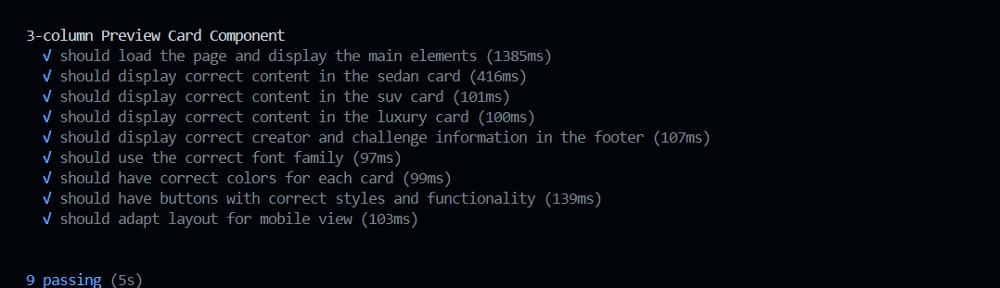

# 3-column preview card component

## Welcome! 👋

### The challenge

Your challenge is to build out this 3-column preview card component and get it looking as close to the design as possible.

Your users should be able to:

- View the optimal layout depending on their device's screen size
- See hover states for interactive elements

# Test Cases

1. Load Main Elements
   This test ensures the main elements of the page load correctly. It checks for the visibility of the main elements such as the articles and footer.

2. Display Content in Sedan Card
   This test verifies that the content in the sedan card is displayed correctly, including the heading, paragraph, and button text.

3. Display Content in SUV Card
   This test verifies that the content in the SUV card is displayed correctly, including the heading, paragraph, and button text.

4. Display Content in Luxury Card
   This test verifies that the content in the luxury card is displayed correctly, including the heading, paragraph, and button text.

5. Display Creator and Challenge Information in the Footer
   This test ensures that the footer contains the correct creator and challenge information. It checks the links for the correct attributes and formats.

6. Correct Font Family
   This test verifies that the correct font family is applied to the body of the page.

7. Correct Colors for Each Card
   This test ensures that each card (sedan, SUV, luxury) has the correct background colors as specified in the design.

8. Button Styles and Functionality
   This test checks the styles of the buttons, including border radius, border color, and background color. It also verifies that the hover and active states of the buttons function correctly.

9. Responsive Layout for Mobile View
   This test verifies that the layout adapts correctly for mobile view. It checks the flex direction and border radius adjustments for smaller screens.
