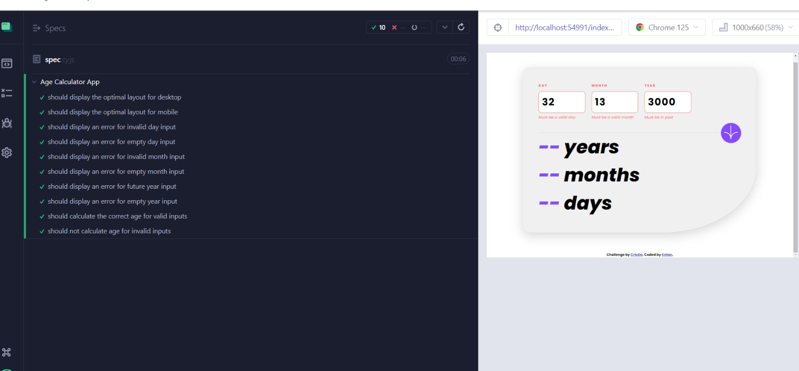

# Age calculator app

## Welcome! 👋

**To do this challenge, you need a decent understanding of HTML, CSS and JavaScript.**

## The challenge

Your challenge is to build out this age calculator app and get it looking as close to the design as possible.

You can use any tools you like to help you complete the challenge. So if you've got something you'd like to practice, feel free to give it a go.

Your users should be able to:

- View an age in years, months, and days after submitting a valid date through the form
- Receive validation errors if:
  - Any field is empty when the form is submitted
  - The day number is not between 1-31
  - The month number is not between 1-12
  - The date is in the future
  - The date is invalid e.g. 31/04/1991 (there are 30 days in April)
- View the optimal layout for the interface depending on their device's screen size
- See hover and focus states for all interactive elements on the page

## Cypress Tests

The tests are defined in the `assessment/cypress/e2e/spec.cy.js` file.

## Test Cases Overview

### 1. Desktop Layout Test

**Test Name: should display the optimal layout for desktop**

- **Description:** Ensures that the app displays correctly on a desktop screen.
- **Steps:**
  1.  Set the viewport to 1280x800 (common desktop resolution).
  2.  Check that the `.content` element has a CSS width of `750px`.
  3.  Verify that the `.input` element has a CSS `flex-direction` of `row` (indicating horizontal alignment).

### 2. Mobile Layout Test

**Test Name: should display the optimal layout for mobile**

- **Description:** Ensures that the app displays correctly on a mobile screen.
- **Steps:**
  1.  Set the viewport to 373x669 (common mobile resolution).
  2.  Check that the `.content` element has a CSS width of `300px`.

### 3. Invalid Day Input Test

**Test Name: should display an error for invalid day input**

- **Description:** Verifies that the app shows an error for invalid day input.
- **Steps:**
  1.  Enter `32` in the `#dayIn` input field and blur (lose focus).
  2.  Check that the next sibling element with class `.error` contains the text "Must be a valid day".

### 4. Empty Day Input Test

**Test Name: should display an error for empty day input**

- **Description:** Verifies that the app shows an error for an empty day input.
- **Steps:**
  1.  Focus on the `#dayIn` input field and then blur without entering anything.
  2.  Check that the next sibling element with class `.error` contains the text "This field is required".

### 5. Invalid Month Input Test

**Test Name: should display an error for invalid month input**

- **Description:** Verifies that the app shows an error for invalid month input.
- **Steps:**
  1.  Enter `13` in the `#monthIn` input field and blur.
  2.  Check that the next sibling element with class `.error` contains the text "Must be a valid month".

### 6. Empty Month Input Test

**Test Name: should display an error for empty month input**

- **Description:** Verifies that the app shows an error for an empty month input.
- **Steps:**
  1.  Focus on the `#monthIn` input field and then blur without entering anything.
  2.  Check that the next sibling element with class `.error` contains the text "This field is required".

### 7. Future Year Input Test

**Test Name: should display an error for future year input**

- **Description:** Verifies that the app shows an error for year inputs in the future.
- **Steps:**
  1.  Enter `3000` in the `#yearIn` input field and blur.
  2.  Check that the next sibling element with class `.error` contains the text "Must be in past".

### 8. Empty Year Input Test

**Test Name: should display an error for empty year input**

- **Description:** Verifies that the app shows an error for an empty year input.
- **Steps:**
  1.  Focus on the `#yearIn` input field and then blur without entering anything.
  2.  Check that the next sibling element with class `.error` contains the text "This field is required".

### 9. Correct Age Calculation Test

**Test Name: should calculate the correct age for valid inputs**

- **Description:** Ensures that the app calculates the correct age when valid inputs are provided.
- **Steps:**
  1.  Get the current date and derive the inputs for a birth date exactly 25 years ago.
  2.  Enter the derived day, month, and year in the respective input fields.
  3.  Click the `#calculateBtn` button.
  4.  Verify that the outputs for `#yearOut`, `#monthOut`, and `#dayOut` display "25", "0", and "0" respectively, indicating the person is exactly 25 years old.

### 10. Invalid Inputs Test

**Test Name: should not calculate age for invalid inputs**

- **Description:** Ensures that the app does not calculate the age when invalid inputs are provided.
- **Steps:**
  1.  Enter `32` in the `#dayIn` input field.
  2.  Enter `13` in the `#monthIn` input field.
  3.  Enter `3000` in the `#yearIn` input field.
  4.  Click the `#calculateBtn` button.
  5.  Verify that the outputs for `#yearOut`, `#monthOut`, and `#dayOut` display "--", indicating that no valid age was calculated due to invalid inputs.
