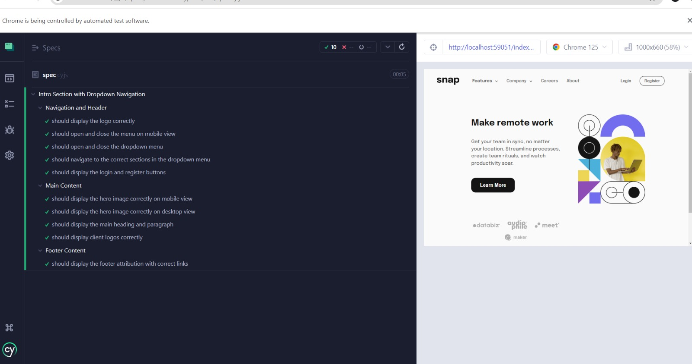

# Frontend Mentor - Intro section with dropdown navigation

## Welcome! 👋

**To do this challenge, you need a basic understanding of HTML, CSS and JavaScript.**

## The challenge

Your challenge is to build out this intro section with dropdown navigation and get it looking as close to the design as possible.

You can use any tools you like to help you complete the challenge. So if you've got something you'd like to practice, feel free to give it a go.

Your users should be able to:

- View the relevant dropdown menus on desktop and mobile when interacting with the navigation links
- View the optimal layout for the content depending on their device's screen size
- See hover states for all interactive elements on the page

## Test Overview

The test suite is designed to ensure the functionality and responsiveness of the "Interactive Card Details Form" project. The tests cover three main areas: navigation and header functionality, main content visibility and responsiveness, and footer content validation. Each test case is aimed at verifying specific aspects of the user interface and interactions to ensure a smooth user experience across different devices.

### Navigation and Header

1.  **Display Logo Correctly**
    
    -   **Objective**: Verify that the logo is displayed correctly with the appropriate attributes.
    -   **Checks**:
        -   The logo is visible.
        -   The logo has an `alt` attribute with the value "snap's logo".
2.  **Open and Close Menu on Mobile View**
    
    -   **Objective**: Test the functionality of the mobile menu.
    -   **Checks**:
        -   Menu button is visible and clickable.
        -   Menu opens correctly with appropriate CSS transform.
        -   Overlay is visible with correct opacity when menu is open.
        -   Menu closes correctly when the close button is clicked.
        -   Overlay is hidden with correct opacity when menu is closed.
3.  **Open and Close Dropdown Menu**
    
    -   **Objective**: Ensure the dropdown menu functionality works correctly.
    -   **Checks**:
        -   Dropdown menu opens when the navigation link is clicked.
        -   Dropdown menu is visible.
        -   Dropdown menu closes when the navigation link is clicked again.
        -   Dropdown menu is hidden.
4.  **Navigate to Correct Sections in Dropdown Menu**
    
    -   **Objective**: Validate that the dropdown menu links navigate to the correct sections.
    -   **Checks**:
        -   Dropdown links have the correct `aria-label` attribute.
5.  **Display Login and Register Buttons**
    
    -   **Objective**: Verify the visibility of login and register buttons.
    -   **Checks**:
        -   Login button is visible.
        -   Register button is visible.

### Main Content

1.  **Display Hero Image on Mobile View**
    
    -   **Objective**: Ensure the hero image is displayed correctly on mobile view.
    -   **Checks**:
        -   Hero image source is correct for mobile view.
        -   Hero image is visible.
2.  **Display Hero Image on Desktop View**
    
    -   **Objective**: Ensure the hero image is displayed correctly on desktop view.
    -   **Checks**:
        -   Hero image source set is correct for desktop view.
3.  **Display Main Heading and Paragraph**
    
    -   **Objective**: Verify the visibility and content of the main heading and paragraph.
    -   **Checks**:
        -   Main heading contains the text "Make remote work".
        -   Main paragraph contains the appropriate text.
4.  **Display Client Logos**
    
    -   **Objective**: Ensure client logos are displayed correctly.
    -   **Checks**:
        -   Each client logo image is visible.

### Footer Content

1.  **Display Footer

### Footer Content (continued)

1.  **Display Footer Attribution with Correct Links**
    -   **Objective**: Ensure the footer attribution contains the correct links.
    -   **Checks**:
        -   The first footer attribution link has the correct `href` attribute pointing to "[https://crio.do](https://crio.do)".
        -   The first footer attribution link has the correct `target` attribute set to "_blank".
