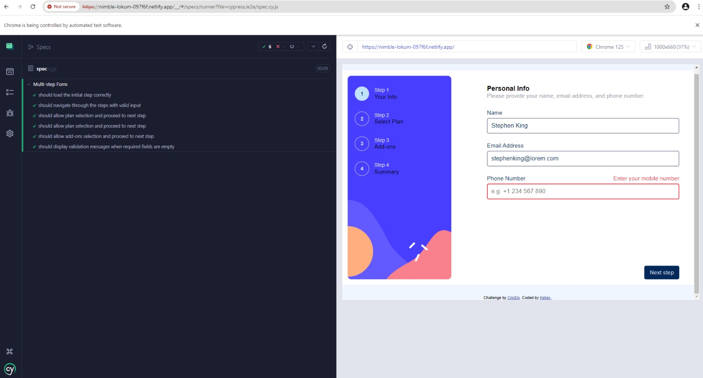

# Multi-step form

## Welcome! 👋

**To do this challenge, you need a good understanding of HTML, CSS and JavaScript.**

## The challenge

Your challenge is to build out this multi-step form and get it looking as close to the design as possible.

Your users should be able to:

- Complete each step of the sequence
- Go back to a previous step to update their selections
- See a summary of their selections on the final step and confirm their order
- View the optimal layout for the interface depending on their device's screen size
- See hover and focus states for all interactive elements on the page
- Receive form validation messages if:
  - A field has been missed
  - The email address is not formatted correctly
  - A step is submitted, but no selection has been made

### Test Overview

The Cypress test suite for the multi-step form application covers several critical functionalities to ensure the form operates correctly. Below is an overview of each test case included in the suite:

#### 1. Load Initial Step Correctly

**Purpose**: This test ensures that the initial step of the form is loaded correctly with all required fields and the next button visible.

**Steps**:

-   Visit the form URL.
-   Verify that the "Step 1" heading is visible.
-   Check for the visibility of input fields: `userName`, `email`, and `phone`.
-   Confirm the visibility of the "Next" button.

#### 2. Navigate Through Steps with Valid Input

**Purpose**: This test ensures that a user can navigate through all the steps of the form by providing valid input in each step.

**Steps**:

-   Fill in the required fields on Step 1 and click "Next".
-   Verify the visibility of Step 2.
-   Select a plan and click "Next".
-   Verify the visibility of Step 3.
-   Select add-ons and click "Next".
-   Verify the visibility of Step 4 and click "Next".
-   Confirm that the final "Thank You!" message is displayed.

#### 3. Allow Plan Selection and Proceed to Next Step

**Purpose**: This test ensures that a user can select a plan and the selection is visually confirmed.

**Steps**:

-   Fill in the required fields on Step 1 and click "Next".
-   Select a plan on Step 2.
-   Verify that the selected plan is highlighted or marked as selected.

#### 4. Allow Add-ons Selection and Proceed to Next Step

**Purpose**: This test ensures that a user can select add-ons and the selections are confirmed as checked.

**Steps**:

-   Fill in the required fields on Step 1 and click "Next".
-   Select a plan on Step 2 and click "Next".
-   Select each available add-on on Step 3.
-   Verify that each selected add-on is checked.

#### 5. Display Validation Messages When Required Fields Are Empty

**Purpose**: This test ensures that appropriate validation messages are displayed when required fields are left empty.

**Steps**:

-   Attempt to proceed to the next step without filling in any fields on Step 1.
-   Verify that validation messages are displayed for `userName`, `email`, and `phone` fields.
-   Fill in only the `userName` and try to proceed.
-   Verify that validation messages are still displayed for the `email` and `phone` fields.
-   Fill in only the `email` and try to proceed.
-   Verify that the validation message is still displayed for the `phone` field.
-   Fill in the `phone` field and proceed to the next step.
-   Confirm that the form proceeds to Step 2.