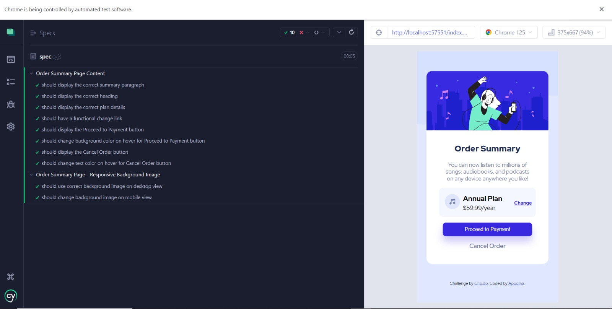

# Order summary card

## Welcome! 👋

**To do this challenge, you need a basic understanding of HTML and CSS.**

## The challenge

Your challenge is to build out this order summary card component and get it looking as close to the design as possible.

You can use any tools you like to help you complete the challenge. So if you've got something you'd like to practice, feel free to give it a go.

Your users should be able to:

- See hover states for interactive elements

### Test Overview

The test cases are organized into two main groups:

1.  **Order Summary Page Content**
2.  **Responsive Background Image**

#### 1. Order Summary Page Content

These tests ensure that the Order Summary page displays the correct content and that the interactive elements function as expected. Each test case is designed to verify specific elements on the page:

-   **Summary Paragraph**:
    
    -   **Test**: Verifies that the summary paragraph contains the specified text.
    -   **Details**: The test checks for the presence of the text "You can now listen to millions of songs, audiobooks, and podcasts on any device anywhere you like!" within the `.summary-para` element. The check is case-insensitive.
-   **Heading**:
    
    -   **Test**: Verifies that the heading contains the text "Order Summary".
    -   **Details**: The test ensures that the `.heading` element contains the exact text "Order Summary".
-   **Plan Details**:
    
    -   **Test**: Verifies that the plan details are displayed correctly.
    -   **Details**: The test checks that the `.plan-text > h3` element contains "Annual Plan" and the `.plan-text > p` element contains "$59.99/year".
-   **Change Link**:
    
    -   **Test**: Verifies that the change link is functional and correctly labeled.
    -   **Details**: The test ensures that the `.change-link > a` element has an `href` attribute with the value `#` and contains the text "Change".
-   **Proceed to Payment Button**:
    
    -   **Test**: Verifies that the "Proceed to Payment" button is displayed and changes background color on hover.
    -   **Details**: The test checks the presence of the `.proceed-btn` element and validates that its background color changes upon hovering.
-   **Cancel Order Button**:
    
    -   **Test**: Verifies that the "Cancel Order" button is displayed and changes text color on hover.
    -   **Details**: The test checks the presence of the `.cancel-order` element and ensures that its text color changes upon hovering.

#### 2. Responsive Background Image

These tests ensure that the correct background image is displayed based on the viewport size, verifying the responsive design of the Order Summary page:

-   **Desktop View**:
    
    -   **Test**: Verifies that the correct background image is used for desktop view.
    -   **Details**: The test sets the viewport to a desktop size (1280x720) and checks that the `body` element's background image includes `pattern-background-desktop.svg`.
-   **Mobile View**:
    
    -   **Test**: Verifies that the correct background image is used for mobile view.
    -   **Details**: The test sets the viewport to a mobile size (375x667) and checks that the `body` element's background image includes `pattern-background-mobile.svg`.
    