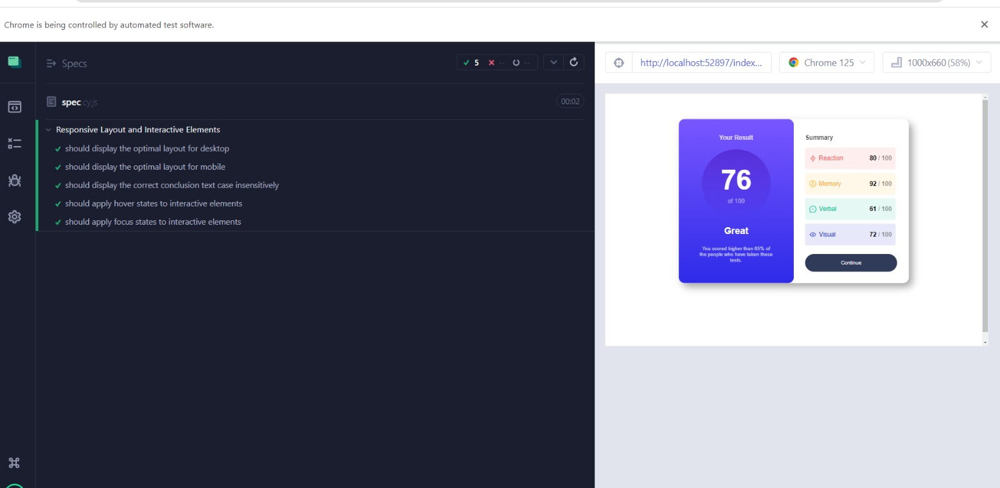

# Frontend Mentor - Results summary component

## Welcome! 👋

**To do this challenge, you need a basic understanding of HTML and CSS.**

## The challenge

Your challenge is to build out this results summary component and get it looking as close to the design as possible.

You can use any tools you like to help you complete the challenge. So if you've got something you'd like to practice, feel free to give it a go.

We provide the data for the results in a local `data.json` file. So you can use that to add the results and total score dynamically if you choose.

Your users should be able to:

- View the optimal layout for the interface depending on their device's screen size
- See hover and focus states for all interactive elements on the page

## Test Suite Overview

The test suite is defined in `cypress/integration/responsive_layout_spec.js` (or similar file). Below is a breakdown of the individual tests included:

### 1. Responsive Layout for Desktop

-   **Description**: Checks that the main layout is optimized for desktop viewports.
-   **Viewport**: 1280x800
-   **Assertions**:
    -   The main container should have a `flex-direction` of `row`.
    -   The main container should have a width of 600px.

### 2. Responsive Layout for Mobile

-   **Description**: Checks that the main layout is optimized for mobile viewports.
-   **Viewport**: 373x669
-   **Assertions**:
    -   The main container should have a `flex-direction` of `column`.
    -   The main container width should be approximately 300px (70% to 90% of the viewport width).

### 3. Case-Insensitive Text Check

-   **Description**: Ensures the conclusion text is displayed correctly, regardless of case.
-   **Element**: `.conclusion`
-   **Assertions**:
    -   The conclusion text should match the expected text case-insensitively.

### 4. Hover State for Interactive Elements

-   **Description**: Verifies that the hover state is applied correctly to buttons.
-   **Element**: `.btn`
-   **Assertions**:
    -   The button should change its background color to `rgb(28, 26, 138)` on hover.

### 5. Focus State for Interactive Elements

-   **Description**: Verifies that the focus state is applied correctly to buttons.
-   **Element**: `.btn`
-   **Assertions**:
    -   The button should have an `outline-style` of `none` when focused.